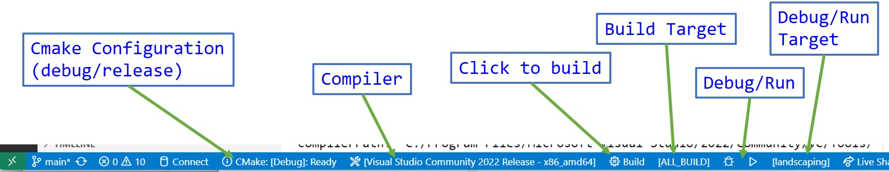

# IntermediateCpp
This repository contains the code for the course Intermediate C++ by Chuck McCullough.  This material is for the exclusive use of the students of the course.  Please do not distribute this material. Copyright 2023 Chuck McCullough.

## Using this repository

If you are using the Remote Learning System (RLS), the repository has already been downloaded and installed on the RLS.  You can skip to the section on Visual Studio Code.  If you are using your own computer, you can download the repository from GitHub as a zip file or you can download the repository using git.  See the section on Git for more information.

This repository requires a C++ compiler compatible with C++20. The code was tested on Windows and Ubuntu.  

The student will need any of these compilers to build the code:

Windows:
* Visual Studio 2022 with the C++ workload
* MSVC developer kit 
* Clang

Linux:
* GCC 
* Clang

Other compilers may work but have not been tested.

## Building the code
The source includes *CMakeLists.txt* which is used by CMAKE to create makefiles for the projects.  The student can use CMAKE to create the makefiles and then use the makefiles to build the code.  The student can also use CMAKE to create a Visual Studio solution file and use Visual Studio to build the code.  

Visit (cmake.org)[https://cmake.org] for more information on CMAKE.  Install cmake on your system before proceeding.

## Visual Studio Code

Visual Studio Code is a language neutral, platform neutral IDE.  With plugins, many of the build tasks are automated.

If you are using our Remote Learning System **(RLS)**, Visual Studio Code is already installed.  If you are using your own computer, you can download Visual Studio Code from (code.visualstudio.com)[https://code.visualstudio.com]. Visual Studio Code is free.

We use the following extensions in Visual Studio Code:
* C/C++ by Microsoft
* C/C++ Extension Pack by Microsoft
* CMake by twxs
* CMake Tools by Microsoft

## Git
You can download this repository from GitHub as a zip file.  If you prefer to download the repository using git, you can install git from (git-scm.com)[https://git-scm.com].  Git is free.

Visual Studio Code integrates with git.  You can use git from the command line or from Visual Studio Code.

The repository has already been downloaded and installed on the RLS.

## Google Test

Some of the lab projects for the class utilize a test-driven approach and use *Google Test* to implement the tests.  The root CMakeLists.txt file will download and install Google Test.  The student does not need to do anything to install Google Test.

## Using Visual Studio Code
Open VS Code and open the *IntermediateCpp* folder (under c:/Studentwork).  If on your own machine, use the option to clone a git repository.  The URL is ```https://github.com/chuckmccullough85/IntermediateCpp.git```

If you have not installed the recommended extensions to VS Code, you will be prompted to install them.  Install the recommended extensions.  Yuo may need to restart VS Code after installing the extensions.

Once the extension are installed, the bottom toolbar will show CMAKE commands.  On the RLS, the Microsoft compiler has been configured.  On you own system, you will need to click the toolkit to choose an available compiler on your system.

There are multiple projects in the workspace.  The current target to run is shown to the right of the run/debug buttons.  You can change the target by clicking on the target and choosing a different target.  



## Adding Projects
To add a new project, create a new folder under the *IntermediateCpp* folder.  

If the project is using *Google Test*, copy the *CMakeLists.txt* file from the *GoogleTestProject* folder to the new folder.

If the project is a console application, copy the *CMakeLists.txt* file from the *ConsoleAppProject* folder to the new folder.

Modify *CMakeLists.txt* in the new folder to change the project name and add source files.  

  Note - the *Target* may appear in several places in the *CMakeLists.txt* file.  Change the target name in all places.  The build will fail if there are multiple targets with the same name.

```
project(new_name)
```
Add source files to the source list (note - the first item in the list is the build target):

```
add_executable(
  capp
  main.cpp
)
```

### Google Test Project Cmake template
```cmake
cmake_minimum_required(VERSION 3.14)
cmake_policy(SET CMP0115 NEW)
##### CHANGE THIS TO THE NAME OF YOUR PROJECT #####
project(GTestTemplate)

# For Windows: Prevent overriding the parent project's compiler/linker settings
set(gtest_force_shared_crt ON CACHE BOOL "" FORCE)

enable_testing()

add_executable(
  GTestTemplate ### <--- Change this to a unique target name!!! ####
  Tests/Sample.cpp ### <--- Add your source files here ####
)

target_link_libraries(
  GTestTemplate  ### <--- Change this to the target name!!! (same as above) ####
  GTest::gtest_main
)

include(GoogleTest)
gtest_discover_tests(GTestTemplate)  ### <--- Change this to the target name!!! (same as above) ####
```

